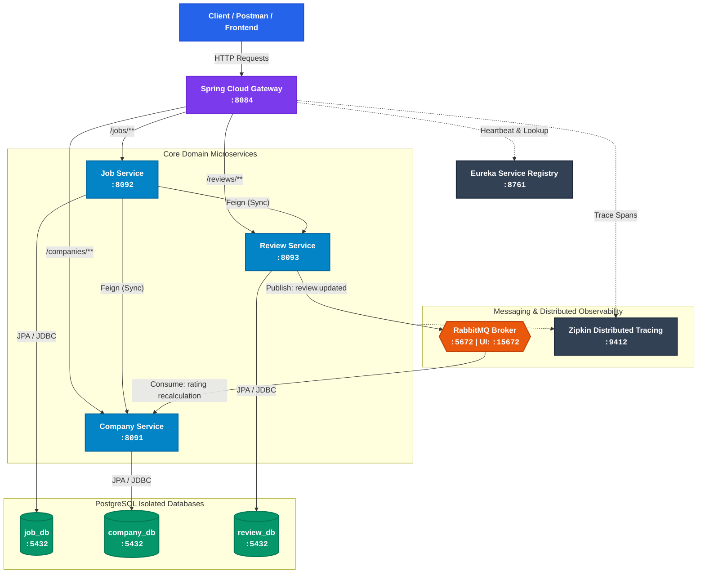

# 🏢 Distributed Job & Company Management Platform

<div align="center">


<p align="center">
  A distributed, cloud-native microservices ecosystem designed for high-availability job aggregation, dynamic discovery, fault-tolerant RPC, and asynchronous event streaming.
</p>

</div>

---
## Architecture Diagram



## Core Technologies & Patterns

* **Frameworks & Core**: Java, Spring Boot 3, Spring Cloud 2023+
* **Routing & Edge**: Spring Cloud Gateway


* **Service Discovery**: Spring Cloud Netflix Eureka


* **Inter-Service Communication**: OpenFeign (declarative HTTP clients)


* **Fault Tolerance & Resilience**: Resilience4j Circuit Breaker (graceful degradation)


* **Message Broker**: RabbitMQ (event-driven review submission & rating updates)


* **Distributed Tracing**: Spring Boot Actuator, Micrometer Tracing, Zipkin


* **Data Persistence**: PostgreSQL 18 (multi-database architecture per domain model)


* **Containerization**: Docker, Docker Compose, multi-container bridge networking


---

## System Services & Port Allocations

| Component / Container | Port (Host) | Internal Port | Description |
| :--- | :--- | :--- | :--- |
| **API Gateway** | `8084` | `8084` | Unified edge reverse proxy routing and predicate path handler |
| **Service Registry** | `8761` | `8761` | Eureka Server for dynamic heartbeat tracking and service discovery |
| **Job Service** | `8092` | `8092` | Manages jobs and aggregates composite DTOs via OpenFeign |
| **Company Service** | `8091` | `8091` | Manages company profiles and consumes rating update events |
| **Review Service** | `8093` | `8093` | Manages reviews and publishes rating events to RabbitMQ |
| **PostgreSQL** | `5432` | `5432` | Relational storage hosting `job_db`, `company_db`, and `review_db` |
| **RabbitMQ** | `5672` / `15672` | `5672` / `15672` | AMQP messaging broker and web management interface |
| **Zipkin** | `9412` | `9411` | Distributed span visualizer and latency tracker |

---

## Key Architectural Highlights

### 1. Synchronous Aggregation with OpenFeign & Resilience4j

When `GET /jobs` is invoked, `Job Service` retrieves raw job entities and initiates parallel OpenFeign RPC calls to `Company Service` and `Review Service` to construct an enriched client response. If upstream dependencies fail, are network-isolated, or return 404, Resilience4j intercepts the disruption and serves a fallback payload to keep the platform responsive.

### 2. Event-Driven Rating Aggregation

When a new review is posted via `POST /reviews?companyId={id}`:

1. `Review Service` persists the review record.


2. A message containing the updated rating payload is placed on the RabbitMQ exchange.


3. `Company Service` consumes the message off the queue asynchronously and recalculates the overall company rating without blocking the review submission thread.


### 3. Distributed Tracing & Observability

Every request entering through the API Gateway receives a unified `traceId` propagated across Feign headers and RabbitMQ message properties. Span waterfalls can be inspected live on Zipkin (`:9412`) to identify bottlenecks and monitor inter-service latency.

---

## Getting Started

### Prerequisites

* [Docker Desktop](https://www.docker.com/) (with Docker Compose v2+)
* [Java Development Kit (JDK) 17+](https://adoptium.net/)
* [PostgreSQL 15+](https://www.postgresql.org/) (running locally or containerized)

### Installation & Deployment

1. **Clone the repository**:
```bash
git clone https://github.com/2024uch1376-spec/Distributed-job-platform.git
cd Distributed-job-platform

```


2. **Configure Environment Variables**:
Create a `.env` file in the root directory:
```env
DB_PASSWORD=your_postgres_password

```


3. **Initialize Databases**:
Ensure PostgreSQL is running and execute the initial schema setup:
```sql
CREATE DATABASE job_db;
CREATE DATABASE company_db;
CREATE DATABASE review_db;

```


4. **Package Application Jars**:
Build each microservice package:
```bash
./mvnw package -DskipTests

```


5. **Spin Up the Microservices Mesh**:
```bash
docker compose up -d --build

```


---

## API Endpoints (Gateway Route Entry: `http://localhost:8084`)

### Jobs Service

* `GET /jobs` — Get all jobs (aggregated with nested company details and review list)


* `GET /jobs/{id}` — Get single job by ID


* `POST /jobs` — Create new job listing

### Companies Service

* `GET /companies` — Get all registered companies


* `GET /companies/{id}` — Get company details and current average rating


* `POST /companies` — Register new company profile

### Reviews Service

* `GET /reviews?companyId={companyId}` — Get reviews for a specific company
* `POST /reviews?companyId={companyId}` — Add new review and emit rating recalculation event


### Dashboards & Monitoring

* **Eureka Service Registry**: `http://localhost:8761`

* **RabbitMQ Management**: `http://localhost:15672` (Default credentials: `guest` / `guest`)


* **Zipkin Distributed Tracing**: `http://localhost:9412`
